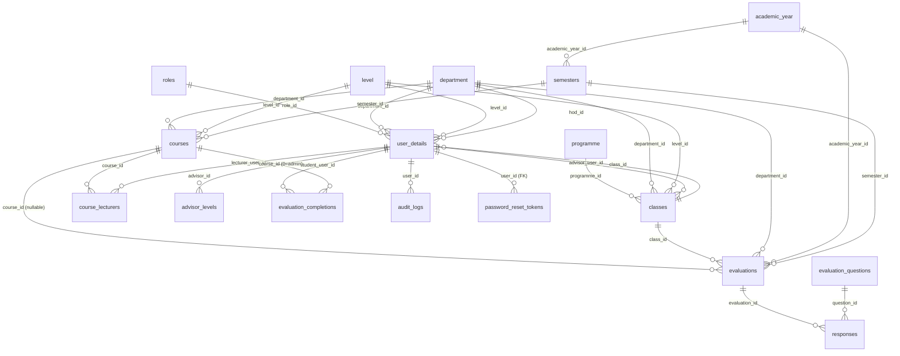

# Database Schema

Reference for the `course_evaluation` database — the structure the application
expects. Use it to understand the data model or to stand up a fresh database
that matches production.

> **Note on SQL files.** Runnable SQL (migration scripts and dumps) is kept
> local-only and is intentionally **not** stored in this repository. This
> Markdown document is the shared, human-readable reference for the schema.

- **Engine / charset:** InnoDB, `utf8mb4` / `utf8mb4_unicode_ci`.
- **Relationships:** almost all relationships are enforced in application code,
  not by database foreign keys. The only database-level foreign key is
  `password_reset_tokens.user_id → user_details.user_id`. The diagram below
  shows the logical relationships regardless of how they are enforced.
- **Primary keys:** lookup tables (`roles`, `department`, `level`, `classes`)
  use `t_id`; `courses` uses `id`; everything else uses `<entity>_id`.

## The evaluation model (how it fits together)

Evaluations are **anonymous** and **tokenless**:

- **`evaluations`** holds a submission's context (course *or* institution-wide)
  and **never** stores who submitted it. `responses` holds the individual 1–5
  ratings for each question.
- **`evaluation_questions.scope`** splits questions into `course` (answered per
  course) and `administrative` (central services + the class-advisor question,
  answered once per semester).
- **`evaluation_completions`** records *that* a student completed an evaluation
  — for eligibility and to prevent duplicates — with **no answers attached**, so
  submissions stay anonymous. `course_id = 0` marks the once-per-semester
  administrative completion; the unique key
  `(student_user_id, course_id, academic_year_id, semester_id)` enforces
  "one per course" and "one administrative per semester".
- A student may evaluate a course when the course's `department_id` and
  `level_id` match the student's — no per-student tokens are issued.

## Entity relationships

Standalone tables not shown above: **`login_attempts`** (login rate-limiting)
and **`questions_archive`** (retired evaluation questions).

The database also defines three read-only **views** used by reports:
`view_active_period`, `view_course_evaluation_stats`, and
`view_department_courses`. Their columns are not listed here.

---

# Table reference

## Identity & organisation

### `roles`

| Column | Type | Null | Key | Default | Notes |
|---|---|---|---|---|---|
| `t_id` | int | no | PRI |  | auto_increment |
| `role_id` | int | no | UNI |  |  |
| `role_name` | varchar(100) | no | UNI |  |  |
| `created_at` | timestamp | no |  | CURRENT_TIMESTAMP | DEFAULT_GENERATED |

### `user_details`

| Column | Type | Null | Key | Default | Notes |
|---|---|---|---|---|---|
| `user_id` | int | no | PRI |  | auto_increment |
| `role_id` | int | no | MUL |  |  |
| `f_name` | varchar(100) | no |  |  |  |
| `l_name` | varchar(100) | no |  |  |  |
| `username` | varchar(100) | yes | UNI |  |  |
| `email` | varchar(150) | no | UNI |  |  |
| `unique_id` | varchar(20) | yes | UNI |  |  |
| `password` | varchar(254) | no |  |  |  |
| `department_id` | int | no | MUL |  |  |
| `class_id` | int | yes | MUL |  |  |
| `level_id` | int | yes | MUL |  |  |
| `is_active` | tinyint(1) | yes |  | 1 |  |
| `created_at` | timestamp | no |  | CURRENT_TIMESTAMP | DEFAULT_GENERATED |
| `updated_at` | timestamp | no |  | CURRENT_TIMESTAMP | DEFAULT_GENERATED on update CURRENT_TIMESTAMP |
| `force_password_change` | tinyint(1) | no |  | 0 | 1 = user must change password before accessing the application |

### `department`

| Column | Type | Null | Key | Default | Notes |
|---|---|---|---|---|---|
| `t_id` | int | no | PRI |  | auto_increment |
| `hod_id` | int | no | MUL | 0 |  |
| `dep_name` | varchar(100) | no |  |  |  |
| `dep_code` | varchar(50) | no | UNI |  |  |
| `created_at` | timestamp | no |  | CURRENT_TIMESTAMP | DEFAULT_GENERATED |

### `programme`

| Column | Type | Null | Key | Default | Notes |
|---|---|---|---|---|---|
| `t_id` | int | no | PRI |  | auto_increment |
| `prog_code` | varchar(20) | no | UNI |  |  |
| `prog_name` | varchar(100) | no |  |  |  |
| `department_id` | int | no | MUL |  |  |
| `created_at` | timestamp | no |  | CURRENT_TIMESTAMP | DEFAULT_GENERATED |

### `level`

| Column | Type | Null | Key | Default | Notes |
|---|---|---|---|---|---|
| `t_id` | int | no | PRI |  | auto_increment |
| `level_name` | varchar(50) | no |  |  |  |
| `level_number` | int | no | UNI |  |  |
| `created_at` | timestamp | no |  | CURRENT_TIMESTAMP | DEFAULT_GENERATED |

### `classes`

| Column | Type | Null | Key | Default | Notes |
|---|---|---|---|---|---|
| `t_id` | int | no | PRI |  | auto_increment |
| `class_name` | varchar(50) | no | UNI |  |  |
| `class_code` | varchar(50) | no |  |  |  |
| `department_id` | int | no | MUL |  |  |
| `advisor_user_id` | int | yes | MUL |  |  |
| `year_of_completion` | int | no |  |  |  |
| `programme_id` | int | no | MUL |  |  |
| `level_id` | int | no | MUL |  |  |
| `created_at` | timestamp | no |  | CURRENT_TIMESTAMP | DEFAULT_GENERATED |

### `courses`

| Column | Type | Null | Key | Default | Notes |
|---|---|---|---|---|---|
| `id` | int | no | PRI |  | auto_increment |
| `course_code` | varchar(50) | no | UNI |  |  |
| `name` | varchar(255) | no |  |  |  |
| `department_id` | int | no | MUL |  |  |
| `level_id` | int | no | MUL |  |  |
| `semester_id` | tinyint | no | MUL |  |  |
| `credit_hours` | tinyint unsigned | no |  | 3 |  |
| `created_at` | timestamp | no |  | CURRENT_TIMESTAMP | DEFAULT_GENERATED |

## Assignments

### `course_lecturers`

| Column | Type | Null | Key | Default | Notes |
|---|---|---|---|---|---|
| `assignment_id` | int | no | PRI |  | auto_increment |
| `course_id` | int | no | MUL |  |  |
| `lecturer_user_id` | int | no | MUL |  |  |
| `academic_year_id` | int | no | MUL |  |  |
| `semester_id` | int | no | MUL |  |  |
| `assigned_by` | int | no | MUL |  | user_id of HOD who made assignment |
| `assigned_at` | timestamp | no |  | CURRENT_TIMESTAMP | DEFAULT_GENERATED |
| `is_active` | tinyint(1) | yes |  | 1 |  |

### `advisor_levels`

| Column | Type | Null | Key | Default | Notes |
|---|---|---|---|---|---|
| `t_id` | int | no | PRI |  | auto_increment |
| `level_id` | int | no | MUL |  |  |
| `department_id` | int | no | MUL |  |  |
| `advisor_id` | int | no | MUL |  |  |
| `created_at` | timestamp | no |  | CURRENT_TIMESTAMP | DEFAULT_GENERATED |

## Academic calendar

### `academic_year`

| Column | Type | Null | Key | Default | Notes |
|---|---|---|---|---|---|
| `academic_year_id` | int | no | PRI |  | auto_increment |
| `start_year` | int | no |  |  |  |
| `end_year` | int | yes |  |  | STORED GENERATED |
| `year_label` | varchar(9) | yes |  |  | STORED GENERATED |
| `is_active` | tinyint(1) | yes | MUL | 0 |  |
| `created_at` | timestamp | no |  | CURRENT_TIMESTAMP | DEFAULT_GENERATED |

### `semesters`

| Column | Type | Null | Key | Default | Notes |
|---|---|---|---|---|---|
| `semester_id` | int | no | PRI |  | auto_increment |
| `academic_year_id` | int | no | MUL |  |  |
| `semester_name` | enum('First','Second') | no |  |  |  |
| `semester_value` | tinyint(1) | no |  |  |  |
| `is_active` | tinyint(1) | no | MUL | 0 |  |
| `created_at` | timestamp | no |  | CURRENT_TIMESTAMP | DEFAULT_GENERATED |

## Evaluation

### `evaluation_questions`

| Column | Type | Null | Key | Default | Notes |
|---|---|---|---|---|---|
| `question_id` | int | no | PRI |  | auto_increment |
| `question_text` | varchar(255) | no |  |  |  |
| `is_required` | tinyint(1) | yes |  | 1 |  |
| `category` | varchar(50) | yes | MUL | General |  |
| `scope` | enum('course','administrative') | no |  | course |  |
| `display_order` | int | yes | MUL | 0 |  |
| `is_active` | tinyint(1) | yes | MUL | 1 |  |
| `created_at` | timestamp | no |  | CURRENT_TIMESTAMP | DEFAULT_GENERATED |

### `evaluations`

| Column | Type | Null | Key | Default | Notes |
|---|---|---|---|---|---|
| `evaluation_id` | int | no | PRI |  | auto_increment |
| `scope` | enum('course','administrative') | no | MUL | course |  |
| `course_id` | int | yes | MUL |  |  |
| `class_id` | int | yes |  |  |  |
| `department_id` | int | yes |  |  |  |
| `academic_year_id` | int | no | MUL |  |  |
| `semester_id` | int | no | MUL |  |  |
| `evaluation_date` | timestamp | no |  | CURRENT_TIMESTAMP | DEFAULT_GENERATED |

### `responses`

| Column | Type | Null | Key | Default | Notes |
|---|---|---|---|---|---|
| `id` | int | no | PRI |  | auto_increment |
| `evaluation_id` | int | no | MUL |  |  |
| `question_id` | int | no | MUL |  |  |
| `response_value` | tinyint | no |  |  |  |
| `created_at` | timestamp | no |  | CURRENT_TIMESTAMP | DEFAULT_GENERATED |

### `evaluation_completions`

| Column | Type | Null | Key | Default | Notes |
|---|---|---|---|---|---|
| `completion_id` | int | no | PRI |  | auto_increment |
| `student_user_id` | int | no | MUL |  |  |
| `scope` | enum('course','administrative') | no | MUL | course |  |
| `course_id` | int | no |  | 0 | 0 = administrative (not course-specific) |
| `academic_year_id` | int | no | MUL |  |  |
| `semester_id` | int | no |  |  |  |
| `completed_at` | timestamp | no |  | CURRENT_TIMESTAMP | DEFAULT_GENERATED |

### `questions_archive`

| Column | Type | Null | Key | Default | Notes |
|---|---|---|---|---|---|
| `question_id` | int | no | PRI |  | auto_increment |
| `question_text` | varchar(255) | no |  |  |  |
| `category` | varchar(50) | yes | MUL | General |  |
| `archived_at` | timestamp | no |  | CURRENT_TIMESTAMP | DEFAULT_GENERATED |
| `archived_by` | int | yes | MUL |  | user_id of admin who archived |

## System & security

### `audit_logs`

| Column | Type | Null | Key | Default | Notes |
|---|---|---|---|---|---|
| `log_id` | int | no | PRI |  | auto_increment |
| `user_id` | int | no | MUL |  |  |
| `action_type` | varchar(50) | no | MUL |  | INSERT, UPDATE, DELETE, LOGIN, LOGOUT, etc. |
| `table_name` | varchar(50) | yes | MUL |  |  |
| `record_id` | int | yes |  |  |  |
| `old_values` | text | yes |  |  | JSON format |
| `new_values` | text | yes |  |  | JSON format |
| `ip_address` | varchar(45) | yes |  |  |  |
| `user_agent` | varchar(255) | yes |  |  |  |
| `created_at` | timestamp | no | MUL | CURRENT_TIMESTAMP | DEFAULT_GENERATED |

### `login_attempts`

| Column | Type | Null | Key | Default | Notes |
|---|---|---|---|---|---|
| `id` | int unsigned | no | PRI |  | auto_increment |
| `ip_address` | varchar(45) | no | MUL |  |  |
| `username_attempted` | varchar(100) | no |  |  |  |
| `attempted_at` | datetime | no |  | CURRENT_TIMESTAMP | DEFAULT_GENERATED |

### `password_reset_tokens`

| Column | Type | Null | Key | Default | Notes |
|---|---|---|---|---|---|
| `id` | int | no | PRI |  | auto_increment |
| `user_id` | int | no | MUL |  |  |
| `token_hash` | varchar(64) | no | UNI |  |  |
| `expires_at` | datetime | no | MUL |  |  |
| `used_at` | datetime | yes |  |  |  |
| `created_at` | datetime | no |  | CURRENT_TIMESTAMP | DEFAULT_GENERATED |
| `ip_address` | varchar(45) | yes |  |  |  |
